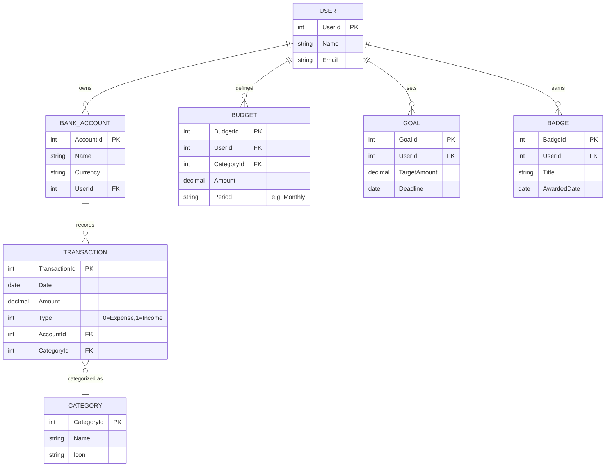

ER Diagram Personal finance apps
       

```mermaid
erDiagram
    USER ||--o{ BANK_ACCOUNT : "owns"
    BANK_ACCOUNT ||--o{ TRANSACTION : "records"
    TRANSACTION }o--|| CATEGORY      : "categorized as"
    USER ||--o{ BUDGET               : "defines"
    USER ||--o{ GOAL                 : "sets"
    USER ||--o{ BADGE                : "earns"

    USER {
        int    UserId PK
        string Name
        string Email
    }
    BANK_ACCOUNT {
        int    AccountId PK
        string Name
        string Currency
        int    UserId FK
    }
    TRANSACTION {
        int     TransactionId PK
        date    Date
        decimal Amount
        int     Type        "0=Expense,1=Income"
        int     AccountId FK
        int     CategoryId FK
    }
    CATEGORY {
        int    CategoryId PK
        string Name
        string Icon
    }
    BUDGET {
        int     BudgetId PK
        int     UserId FK
        int     CategoryId FK
        decimal Amount
        string  Period     "e.g. Monthly"
    }
    GOAL {
        int     GoalId PK
        int     UserId FK
        decimal TargetAmount
        date    Deadline
    }
    BADGE {
        int    BadgeId PK
        int    UserId FK
        string Title
        date   AwardedDate
    }
```
